# Power BI Git Demo

[](https://github.com/samueltauil/powerbi-git-demo/fork)

A demonstration Power BI project showing how to integrate a Power BI report and semantic model with GitHub using Microsoft Fabric's Git integration feature.

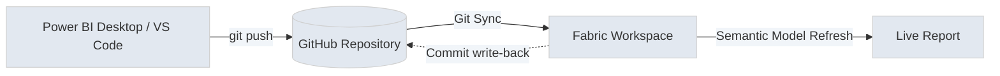
```mermaid
%%{init: {'theme':'base', 'themeVariables': {'lineColor':'#333333','primaryTextColor':'#333','secondaryTextColor':'#333','tertiaryTextColor':'#333','primaryColor':'#e2e8f0','secondaryColor':'#f1f5f9'}}}%%
flowchart LR
    A[Power BI Desktop / VS Code] -->|git push| B[(GitHub Repository)]
    B -->|Git Sync| C[Fabric Workspace]
    C -->|Semantic Model Refresh| D[Live Report]
    C -.->|Commit write-back| B
```

## Contents

| Item | Description |
|---|---|
| `My new report.Report/` | Power BI report definition (PBIR format) — contains the visual layout, theme, and static resources |
| `My new report.SemanticModel/` | Semantic model definition (TMDL format) with embedded sample sales data |
| `My new report.pbip` | Power BI project file for opening in Power BI Desktop |
| `My new report.pbit` | Power BI Template — a portable version of the report without data (users are prompted for parameters on open) |
| `Regional-Sales.pbit` | An additional Power BI Template with a regional sales report layout |
| `docs/` | Screenshots used in this documentation |
| `.gitignore` | Git ignore rules for Power BI local settings files |

## Key Concepts / Glossary

New to the Power BI / Microsoft Fabric ecosystem? This section defines the key terms used throughout this guide.

| Term | Definition |
|---|---|
| **[Semantic Model](https://learn.microsoft.com/en-us/power-bi/connect-data/service-datasets-understand)** | The data layer of a Power BI report — defines tables, columns, relationships, and measures. Formerly called a "dataset." |
| **[TMDL](https://learn.microsoft.com/en-us/analysis-services/tmdl/tmdl-overview)** | Tabular Model Definition Language — a human-readable, text-based format for defining semantic models, designed for Git-based source control. It replaces the older BIM/JSON format. |
| **[PBIR](https://learn.microsoft.com/en-us/power-bi/developer/projects/projects-report)** | Power BI Report format — the text-based, deconstructed format for report layouts, replacing the binary `.pbix`. |
| **[PBIP](https://learn.microsoft.com/en-us/power-bi/developer/projects/projects-overview)** | Power BI Project — a project file that points to the `.Report` and `.SemanticModel` folders, allowing Power BI Desktop to open them as an editable project. |
| **PBIT** | Power BI Template — a portable template that includes report layout and model metadata but no data. Users are prompted for parameters when opening. |
| **[Fabric Workspace](https://learn.microsoft.com/en-us/fabric/get-started/workspaces)** | A collaborative container in Microsoft Fabric that holds Power BI reports, semantic models, notebooks, and other items. Similar to a "project" in other platforms. |

## .gitignore Explained

When you open a `.pbip` project in Power BI Desktop, the tool generates local-only files under `.pbi/` directories. The `.gitignore` in this repo excludes:

```
**/.pbi/localSettings.json    # user-specific editor preferences
**/.pbi/editorSettings.json   # user-specific editor preferences
**/.pbi/cache.abf             # cached in-memory data (can be large)
**/.pbi/unappliedChanges.json # staging file for uncommitted changes
```

These files are **machine-specific** and must never be committed — doing so would cause unnecessary merge conflicts and potentially expose local configuration. See [Power BI Projects and Git integration](https://learn.microsoft.com/en-us/power-bi/developer/projects/projects-git) for more details.

## What the Report Shows

The included report (`My new report`) contains a single page with the following visuals:

- **Donut Chart** — Profit broken down by Product Category, giving a quick proportional view of which categories drive the most profit
- **Image** — The Adventure Works company logo (used as a branding element in the report header)
- **Table** — State-level data showing Population, Sales per Capita, and Sum of Sales, enabling geographic performance analysis

This uses the Adventure Works sample data embedded directly in the semantic model (no external data source required).

## Data Model Overview

The semantic model contains 10 tables organized around a central **Sales** fact table.

| Table | Role | Description |
|---|---|---|
| **Sales** | Fact | Sales transactions with keys to Product, Region, Reseller, Date, and Salesperson |
| **Date** | Dimension | Date dimension table |
| **Product** | Dimension | Product dimension with Category, Subcategory, etc. |
| **Region** | Dimension | Sales territory dimension |
| **Reseller** | Dimension | Reseller dimension |
| **Salesperson** | Dimension | Salesperson dimension |
| **Salesperson (Performance)** | Dimension | Salesperson performance tracking |
| **SalespersonRegion** | Bridge | Junction table linking salespeople to regions |
| **Targets** | Fact | Sales targets per employee per month |
| **US Population** | Reference | State populations for per-capita analysis |

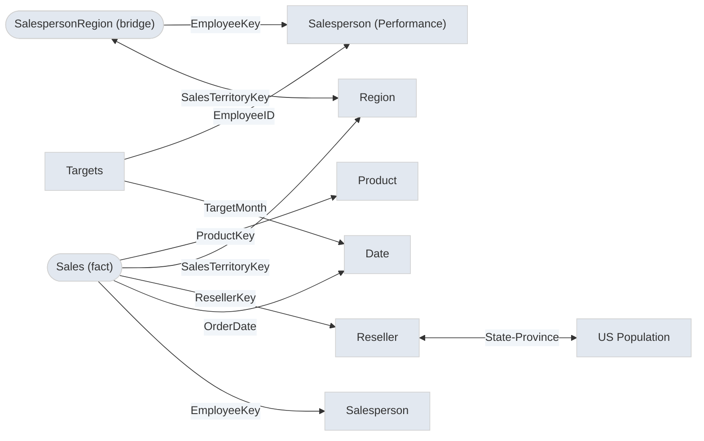
```mermaid
%%{init: {'theme':'base', 'themeVariables': {'lineColor':'#333333','primaryTextColor':'#333','secondaryTextColor':'#333','tertiaryTextColor':'#333','primaryColor':'#e2e8f0','secondaryColor':'#f1f5f9'}}}%%
flowchart LR
    Sales(["Sales (fact)"])
    SPR(["SalespersonRegion (bridge)"])
    SP["Salesperson (Performance)"]
    USPop["US Population"]

    Sales -->|ProductKey| Product
    Sales -->|SalesTerritoryKey| Region
    Sales -->|ResellerKey| Reseller
    Sales -->|OrderDate| Date
    Sales -->|EmployeeKey| Salesperson
    SPR -->|EmployeeKey| SP
    SPR <-->|SalesTerritoryKey| Region
    Targets -->|EmployeeID| SP
    Targets -->|TargetMonth| Date
    Reseller <-->|"State-Province"| USPop
```

> Arrows with double heads (`<-->`) indicate **bidirectional** cross-filter relationships.

## Syncing This Repo to Microsoft Fabric

### Compatibility / Requirements

| Requirement | Minimum Version |
|---|---|
| Power BI Desktop | 2.137+ (October 2024 or later) |
| Microsoft Fabric | Any capacity (Trial, Premium, or Fabric) |
| PBIP format support | Enabled by default in Power BI Desktop 2.137+ |

### Prerequisites

- A Microsoft Fabric workspace (Trial, Power BI Premium, or Fabric capacity)
- A GitHub account with your own fork of this repository
- Fabric workspace Admin or Member role

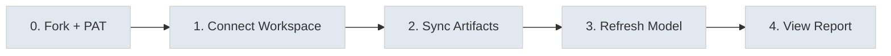
```mermaid
%%{init: {'theme':'base', 'themeVariables': {'lineColor':'#333333','primaryTextColor':'#333','secondaryTextColor':'#333','tertiaryTextColor':'#333','primaryColor':'#e2e8f0','secondaryColor':'#f1f5f9'}}}%%
flowchart LR
    A["0. Fork + PAT"] --> B["1. Connect Workspace"]
    B --> C["2. Sync Artifacts"]
    C --> D["3. Refresh Model"]
    D --> E["4. View Report"]
```

### Step 0 — Fork This Repository and Create a GitHub PAT

Fabric's Git integration requires **write access** to the repository (to commit changes back from Fabric). You must fork this repo into your own GitHub account and authenticate with a Personal Access Token (PAT).

#### Fork the repository

1. Click the **Fork this repo** button at the top of this page, or click **Fork** at the top right on GitHub
2. Select your personal account as the destination
3. Click **Create fork**

#### Create a GitHub Personal Access Token (PAT)

1. Go to **GitHub** → click your profile photo → **Settings**
2. Scroll down to **Developer settings** → **Personal access tokens** → **Tokens (classic)**
3. Click **Generate new token (classic)**
4. Give it a descriptive name, e.g. `Fabric Git Integration`
5. Set an expiration (90 days recommended)
6. Under **Scopes**, check:
   - `repo` (full control of private repositories)
7. Click **Generate token**
8. **Copy the token immediately** — you won't be able to see it again

> **Security notes:**
> - As of 2026, PATs are the **only** supported authentication method for Fabric ↔ GitHub integration (service principals and GitHub Apps are not yet supported).
> - [Fine-grained personal access tokens](https://docs.github.com/en/authentication/keeping-your-account-and-data-secure/managing-your-personal-access-tokens#fine-grained-personal-access-tokens) are a more secure alternative to classic tokens and can be scoped to specific repositories.
> - Store your PAT in a **password manager** and set a calendar reminder to rotate it before expiry.
> - Keep your PAT secure. Do not commit it to any file or share it publicly.

### Step 1 — Connect Your Fabric Workspace to GitHub

1. Open your **Fabric workspace** in [app.fabric.microsoft.com](https://app.fabric.microsoft.com)
2. Click **Workspace settings** (gear icon in the top right of the workspace)
3. Select **Git integration** from the left menu
4. Under **Git provider**, select **GitHub**
5. Click **Connect to GitHub** and choose **Add account with a token**
6. Paste your **GitHub PAT** from Step 0 and click **Add**
7. Fill in the connection details:
   - **Organization**: your GitHub username
   - **Repository**: `powerbi-git-demo` (your fork)
   - **Branch**: `main`
   - **Git folder**: `/` (root)
8. Click **Connect and sync**

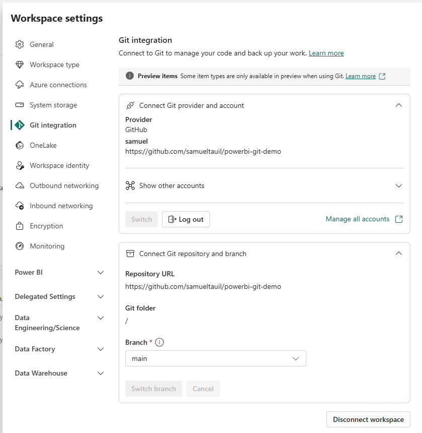

### Step 2 — Initial Sync

1. After connecting, Fabric will compare the workspace with the repository
2. Click **Sync** to pull the report and semantic model into your workspace
3. The items **My new report** (Report) and **My new report** (Semantic Model) will appear in your workspace

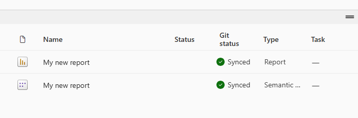

### Step 3 — Refresh the Semantic Model

After syncing, the semantic model is deployed but not yet loaded with data. You must trigger a refresh:

1. In your workspace, find the **My new report** semantic model
2. Click the `...` menu → **Refresh now**
3. Wait for the refresh to complete (status shows a green checkmark)
4. Open the **My new report** report — it should now display data

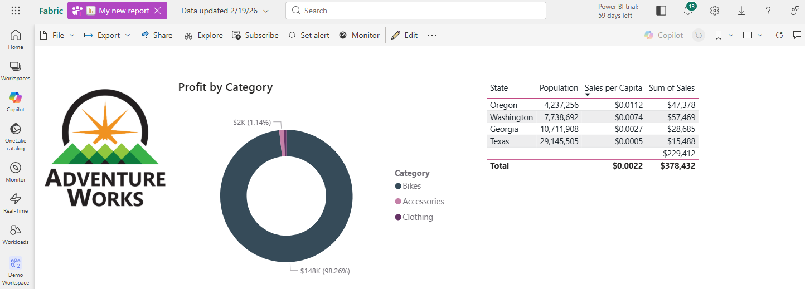

### Updating the Report from Git

Whenever changes are pushed to the `main` branch:

1. Go to your Fabric workspace
2. Click **Workspace settings** → **Git integration**
3. Click **Update all** to pull the latest changes from GitHub

### Publishing Changes from Fabric Back to Git

1. Make changes to your report or semantic model in Fabric
2. Go to **Workspace settings** → **Git integration**
3. Staged changes will appear — click **Commit** to push them back to GitHub

## Local Development with Power BI Desktop

1. Clone this repository
2. Open `My new report.pbip` in Power BI Desktop (version 2.137+)
3. Make edits and save — changes are written directly to the TMDL/PBIR source files
4. Commit and push via Git to sync back to Fabric

## Deployment Models with GitHub and Microsoft Fabric

> Based on the official Microsoft guidance: [Choose the best Fabric CI/CD workflow option for you](https://learn.microsoft.com/en-us/fabric/cicd/manage-deployment?WT.mc_id=DP-MVP-5004032#development-process)

This repo demonstrates the simplest form of Fabric Git integration, but production teams typically adopt one of the CI/CD patterns below depending on their scale and requirements.

### Development Process (Common to All Options)

Regardless of the deployment model, the development loop is the same: developers work in an isolated environment — either **Power BI Desktop / VS Code locally** or a **dedicated dev workspace** in Fabric — and commit changes to a feature branch. A Pull Request (PR) review process gates what gets merged into shared branches.

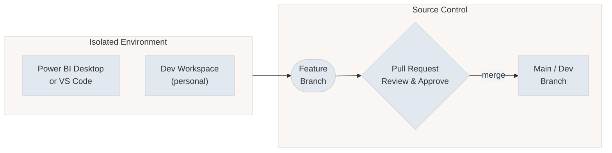
```mermaid
%%{init: {'theme':'base', 'themeVariables': {'lineColor':'#333333','primaryTextColor':'#333','secondaryTextColor':'#333','tertiaryTextColor':'#333','primaryColor':'#e2e8f0','secondaryColor':'#f1f5f9'}}}%%
flowchart LR
    subgraph isolated ["Isolated Environment"]
        direction TB
        IDE["Power BI Desktop<br/>or VS Code"]
        DWS["Dev Workspace<br/>(personal)"]
    end

    subgraph git ["Source Control"]
        direction TB
        FB(["Feature<br/>Branch"])
        PR{"Pull Request<br/>Review & Approve"}
        MAIN["Main / Dev<br/>Branch"]
    end

    isolated --> FB
    FB --> PR
    PR -->|merge| MAIN
```

### Option 1 — Git-Based Deployments (Recommended for Most Teams)

Each environment stage (Dev, Test, Prod) maps to a **dedicated Git branch** and a **dedicated Fabric workspace**. When a PR is merged into the Dev branch, a release pipeline automatically syncs that branch to the Dev workspace using the [Fabric Git APIs](https://learn.microsoft.com/en-us/rest/api/fabric/core/git/update-from-git). Promotion to Test and Prod happens via additional PRs through the same branch-per-stage pattern.

**Best for:** Teams following **Gitflow**, where `main`/`dev`/`test` are long-lived branches.

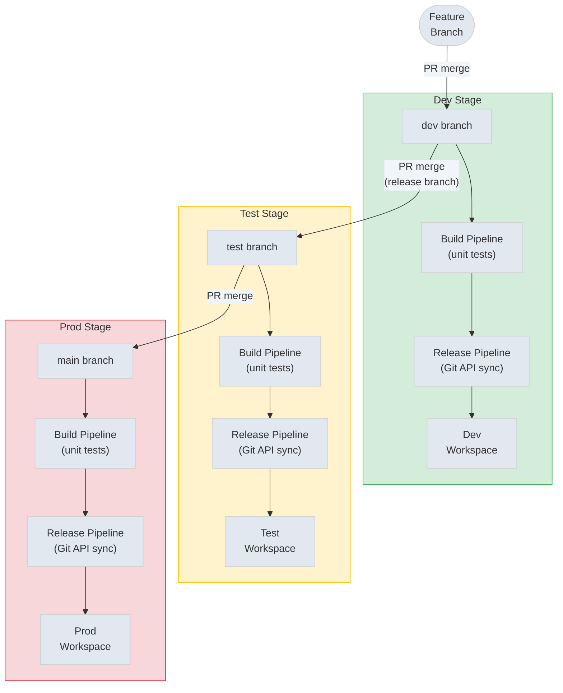
```mermaid
%%{init: {'theme':'base', 'themeVariables': {'lineColor':'#333333','primaryTextColor':'#333','secondaryTextColor':'#333','tertiaryTextColor':'#333','primaryColor':'#e2e8f0','secondaryColor':'#f1f5f9'}}}%%
flowchart TD
    FB(["Feature<br/>Branch"]) -->|"PR merge"| DB

    subgraph dev ["Dev Stage"]
        DB["dev branch"] --> DBP["Build Pipeline<br/>(unit tests)"]
        DBP --> DRP["Release Pipeline<br/>(Git API sync)"]
        DRP --> DW["Dev<br/>Workspace"]
    end

    DB -->|"PR merge<br/>(release branch)"| TB

    subgraph test ["Test Stage"]
        TB["test branch"] --> TBP["Build Pipeline<br/>(unit tests)"]
        TBP --> TRP["Release Pipeline<br/>(Git API sync)"]
        TRP --> TW["Test<br/>Workspace"]
    end

    TB -->|"PR merge"| MB

    subgraph prod ["Prod Stage"]
        MB["main branch"] --> PBP["Build Pipeline<br/>(unit tests)"]
        PBP --> PRP["Release Pipeline<br/>(Git API sync)"]
        PRP --> PW["Prod<br/>Workspace"]
    end

    style dev fill:#d4edda,stroke:#28a745,color:#333
    style test fill:#fff3cd,stroke:#ffc107,color:#333
    style prod fill:#f8d7da,stroke:#dc3545,color:#333
```

### Option 2 — Git-Based Deployments with Build Environments

All deployments originate from a **single `main` branch**, but a **build environment** (e.g. a GitHub Actions runner) pre-processes the files before uploading them to each workspace — swapping out connection IDs, lakehouse IDs, or parameter values per stage. Uses the [fabric-cicd Python library](https://microsoft.github.io/fabric-cicd) or the [Fabric Item APIs](https://learn.microsoft.com/en-us/rest/api/fabric/core/items) to push changes.

**Best for:** Teams following **trunk-based development** or who need environment-specific config substitution before deployment.

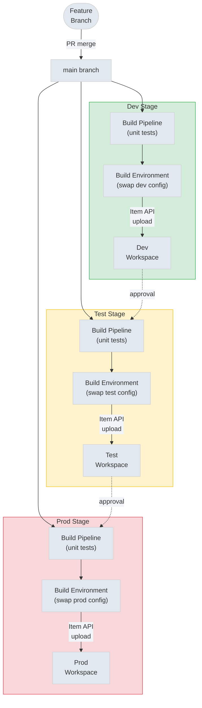
```mermaid
%%{init: {'theme':'base', 'themeVariables': {'lineColor':'#333333','primaryTextColor':'#333','secondaryTextColor':'#333','tertiaryTextColor':'#333','primaryColor':'#e2e8f0','secondaryColor':'#f1f5f9'}}}%%
flowchart TD
    FB(["Feature<br/>Branch"]) -->|"PR merge"| MB["main branch"]

    MB --> DEV_BUILD

    subgraph dev ["Dev Stage"]
        DEV_BUILD["Build Pipeline<br/>(unit tests)"] --> DEV_ENV["Build Environment<br/>(swap dev config)"]
        DEV_ENV -->|"Item API<br/>upload"| DW["Dev<br/>Workspace"]
    end

    MB --> TEST_BUILD

    subgraph test ["Test Stage"]
        TEST_BUILD["Build Pipeline<br/>(unit tests)"] --> TEST_ENV["Build Environment<br/>(swap test config)"]
        TEST_ENV -->|"Item API<br/>upload"| TW["Test<br/>Workspace"]
    end

    MB --> PROD_BUILD

    subgraph prod ["Prod Stage"]
        PROD_BUILD["Build Pipeline<br/>(unit tests)"] --> PROD_ENV["Build Environment<br/>(swap prod config)"]
        PROD_ENV -->|"Item API<br/>upload"| PW["Prod<br/>Workspace"]
    end

    DW -.->|"approval"| TEST_BUILD
    TW -.->|"approval"| PROD_BUILD

    style dev fill:#d4edda,stroke:#28a745,color:#333
    style test fill:#fff3cd,stroke:#ffc107,color:#333
    style prod fill:#f8d7da,stroke:#dc3545,color:#333
```

### Option 3 — Git + Fabric Deployment Pipelines

Git is connected only to the **Dev workspace**. Promotion from Dev → Test → Prod is handled by **Fabric's built-in deployment pipelines**, which can be triggered programmatically via the [deployment pipeline APIs](https://learn.microsoft.com/en-us/rest/api/fabric/core/deployment-pipelines) inside a GitHub Actions workflow.

**Best for:** Teams who prefer Fabric-native tooling for cross-stage promotion and want visibility into deployment history inside Fabric.

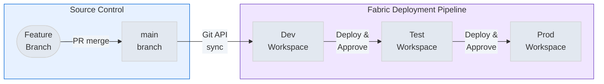
```mermaid
%%{init: {'theme':'base', 'themeVariables': {'lineColor':'#333333','primaryTextColor':'#333','secondaryTextColor':'#333','tertiaryTextColor':'#333','primaryColor':'#e2e8f0','secondaryColor':'#f1f5f9'}}}%%
flowchart LR
    subgraph git ["Source Control"]
        FB(["Feature<br/>Branch"]) -->|"PR merge"| MB["main<br/>branch"]
    end

    MB -->|"Git API<br/>sync"| DW

    subgraph fabric ["Fabric Deployment Pipeline"]
        DW["Dev<br/>Workspace"] -->|"Deploy &<br/>Approve"| TW["Test<br/>Workspace"]
        TW -->|"Deploy &<br/>Approve"| PW["Prod<br/>Workspace"]
    end

    style git fill:#e7f1ff,stroke:#0366d6,color:#333
    style fabric fill:#f0e6ff,stroke:#6f42c1,color:#333
```

### Option 4 — ISV / Multi-Tenant Deployments

An extension of Option 2 for **Independent Software Vendors (ISVs)** managing hundreds or thousands of customer workspaces. A single centralized Dev/Test process feeds into per-customer Prod workspaces, with customer-specific configuration injected at deployment time via scripts or APIs.

**Best for:** SaaS providers building analytics solutions on top of Fabric at scale.

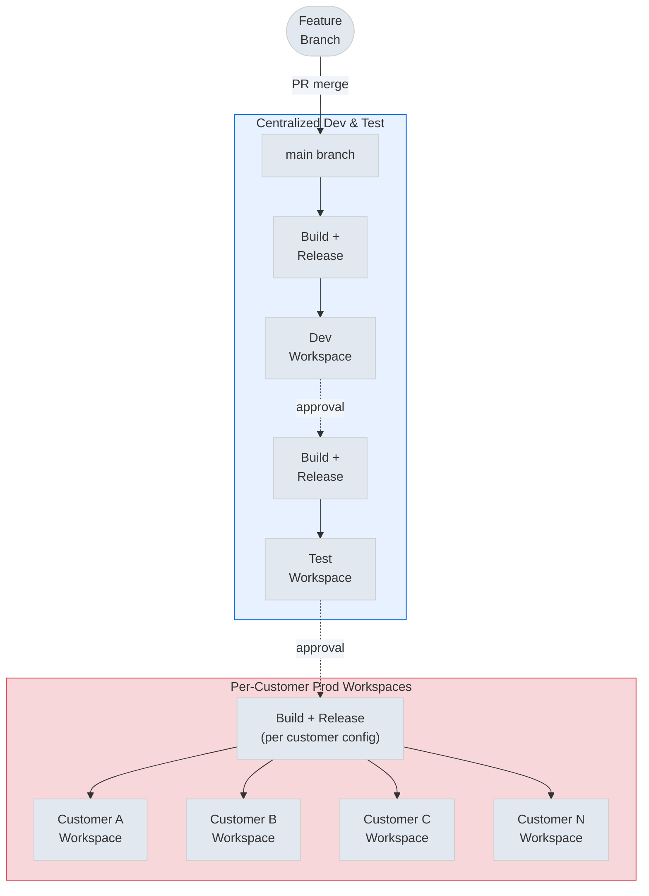
```mermaid
%%{init: {'theme':'base', 'themeVariables': {'lineColor':'#333333','primaryTextColor':'#333','secondaryTextColor':'#333','tertiaryTextColor':'#333','primaryColor':'#e2e8f0','secondaryColor':'#f1f5f9'}}}%%
flowchart TD
    FB(["Feature<br/>Branch"]) -->|"PR merge"| MB["main branch"]

    subgraph central ["Centralized Dev & Test"]
        direction LR
        MB --> DEV_BUILD["Build +<br/>Release"]
        DEV_BUILD --> DW["Dev<br/>Workspace"]
        DW -.->|"approval"| TEST_BUILD["Build +<br/>Release"]
        TEST_BUILD --> TW["Test<br/>Workspace"]
    end

    TW -.->|"approval"| PROD_PIPE

    subgraph customers ["Per-Customer Prod Workspaces"]
        PROD_PIPE["Build + Release<br/>(per customer config)"] --> C1["Customer A<br/>Workspace"]
        PROD_PIPE --> C2["Customer B<br/>Workspace"]
        PROD_PIPE --> C3["Customer C<br/>Workspace"]
        PROD_PIPE --> CN["Customer N<br/>Workspace"]
    end

    style central fill:#e7f1ff,stroke:#0366d6,color:#333
    style customers fill:#f8d7da,stroke:#dc3545,color:#333
```

### Which Option Fits This Repo?

This repo includes both modes:

- **Basic mode** — A single `main` branch connected directly to one Fabric workspace via Fabric's Git integration (see [Syncing This Repo to Microsoft Fabric](#syncing-this-repo-to-microsoft-fabric)).
- **Full CI/CD mode** — A multi-stage pipeline combining **Option 1** (branch-per-environment strategy) with **Option 2** (fabric-cicd parameter overrides). Ready-to-run pipelines are provided for both **GitHub Actions** and **Azure DevOps Pipelines**.

### CI/CD Implementation

This repo ships with a complete, demo-ready CI/CD setup that deploys Power BI items to environment-specific Fabric workspaces using the [`fabric-cicd`](https://microsoft.github.io/fabric-cicd) Python library.

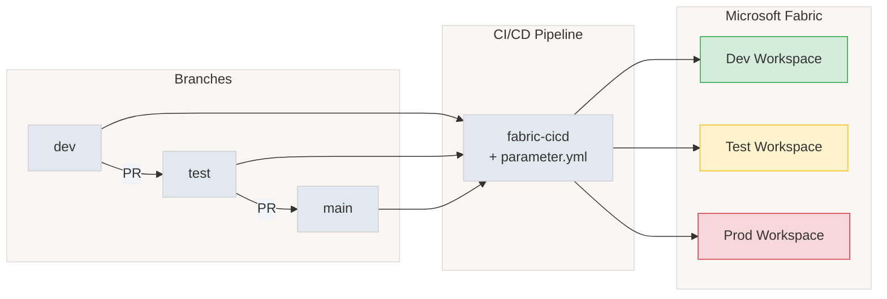
```mermaid
%%{init: {'theme':'base', 'themeVariables': {'lineColor':'#333333','primaryTextColor':'#333','secondaryTextColor':'#333','tertiaryTextColor':'#333','primaryColor':'#e2e8f0','secondaryColor':'#f1f5f9'}}}%%
flowchart LR
    subgraph branches ["Branches"]
        DEV["dev"] -->|PR| TEST["test"] -->|PR| MAIN["main"]
    end

    subgraph pipeline ["CI/CD Pipeline"]
        P["fabric-cicd<br/>+ parameter.yml"]
    end

    subgraph fabric ["Microsoft Fabric"]
        DW["Dev Workspace"]
        TW["Test Workspace"]
        PW["Prod Workspace"]
    end

    DEV  --> P --> DW
    TEST --> P --> TW
    MAIN --> P --> PW

    style DW fill:#d4edda,stroke:#28a745
    style TW fill:#fff3cd,stroke:#ffc107
    style PW fill:#f8d7da,stroke:#dc3545
```

**How it works:** Source files always contain DEV values. When deploying to TEST or PROD, `fabric-cicd` reads `parameter.yml` and swaps environment-specific values (connection IDs, lakehouse references, etc.) at deployment time — no manual find-and-replace in PRs.

**How to validate the replaced values:**
1. Install VS Code + the Fabric Studio extension.
2. Log in to your Microsoft Fabric/Power BI account.
3. In the Fabric Workspaces panel, expand your Semantic Model.
4. Navigate to Definition folder > Definition folder > expressions.tmdl.
5. The file will open showing the current live state of the deployed model — compare it against your git-committed version.

#### CI/CD Files

| File | Purpose |
|---|---|
| `parameter.yml` | Environment-specific value overrides for `fabric-cicd` |
| `.deploy/fabric_workspace.py` | Python deployment script (shared by both pipeline platforms) |
| `requirements.txt` | Python dependencies (`fabric-cicd`, `azure-identity`) |
| `.github/workflows/deploy-fabric.yml` | GitHub Actions workflow — triggers on push to `dev`/`test`/`main` |
| `azure-pipelines/deploy-fabric.yml` | Azure Pipelines YAML — triggers on push to `dev`/`test`/`main` |

#### Demo Guides

Choose the platform you want to demo on:

- **[GitHub Actions Demo](docs/GITHUB_DEMO.md)** — Full walkthrough using GitHub Environments and GitHub Actions
- **[Azure DevOps Demo](docs/AZURE_DEVOPS_DEMO.md)** — Full walkthrough using Azure DevOps Service Connections, Variable Groups, and Azure Pipelines

---

## Troubleshooting

| Problem | Cause / Solution |
|---|---|
| Report shows blank / no data after sync | The semantic model needs to be refreshed (Step 3). Syncing deploys the model definition but does not load data. |
| "Access denied" when connecting Fabric to GitHub | Your PAT may have expired or was created with insufficient scopes. Regenerate with the `repo` scope. |
| Git sync shows conflicts | This happens when changes are made simultaneously in Fabric and locally. Resolve conflicts in Git before syncing again. |
| `.pbip` file won't open in Power BI Desktop | You need Power BI Desktop version 2.137 or later. Update to the latest version. |
| Semantic model refresh fails | Ensure the workspace has sufficient capacity and that any data source credentials are configured. |

## Additional Resources

| Resource | Link |
|---|---|
| Power BI Projects overview | [learn.microsoft.com](https://learn.microsoft.com/en-us/power-bi/developer/projects/projects-overview) |
| TMDL overview | [learn.microsoft.com](https://learn.microsoft.com/en-us/analysis-services/tmdl/tmdl-overview) |
| Get started with Fabric Git integration (GitHub) | [learn.microsoft.com](https://learn.microsoft.com/en-us/fabric/cicd/git-integration/git-get-started?tabs=github) |
| Overview of Fabric Git integration | [learn.microsoft.com](https://learn.microsoft.com/en-us/fabric/cicd/git-integration/intro-to-git-integration) |
| Automate Git integration with APIs | [learn.microsoft.com](https://learn.microsoft.com/en-us/fabric/cicd/git-integration/git-automation) |

---

## License

This project is licensed under the MIT License — see [LICENSE](LICENSE) for details.
