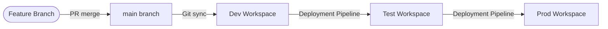

# Power BI Git Demo

A demonstration Power BI project showing how to integrate a Power BI report and semantic model with GitHub using Microsoft Fabric's Git integration feature.

## Contents

| Item | Description |
|---|---|
| `My new report.Report/` | Power BI report definition (PBIR format) |
| `My new report.SemanticModel/` | Semantic model definition (TMDL format) with embedded sample sales data |
| `My new report.pbip` | Power BI project file for opening in Power BI Desktop |

## Syncing This Repo to Microsoft Fabric

### Prerequisites

- A Microsoft Fabric workspace (Trial, Power BI Premium, or Fabric capacity)
- A GitHub account with your own fork of this repository
- Fabric workspace Admin or Member role

### Step 0 — Fork This Repository and Create a GitHub PAT

Fabric's Git integration requires **write access** to the repository (to commit changes back from Fabric). You must fork this repo into your own GitHub account and authenticate with a Personal Access Token (PAT).

#### Fork the repository

1. Click the **Fork this repo** button at the top of this page, or click **Fork** at the top right on GitHub
2. Select your personal account as the destination
3. Click **Create fork**

#### Create a GitHub Personal Access Token (PAT)

1. Go to **GitHub** → click your profile photo → **Settings**
2. Scroll down to **Developer settings** → **Personal access tokens** → **Tokens (classic)**
3. Click **Generate new token (classic)**
4. Give it a descriptive name, e.g. `Fabric Git Integration`
5. Set an expiration (90 days recommended)
6. Under **Scopes**, check:
   - `repo` (full control of private repositories)
7. Click **Generate token**
8. **Copy the token immediately** — you won't be able to see it again

> Keep your PAT secure. Do not commit it to any file or share it publicly.

### Step 1 — Connect Your Fabric Workspace to GitHub

1. Open your **Fabric workspace** in [app.fabric.microsoft.com](https://app.fabric.microsoft.com)
2. Click **Workspace settings** (gear icon in the top right of the workspace)
3. Select **Git integration** from the left menu
4. Under **Git provider**, select **GitHub**
5. Click **Connect to GitHub** and choose **Add account with a token**
6. Paste your **GitHub PAT** from Step 0 and click **Add**
7. Fill in the connection details:
   - **Organization**: your GitHub username
   - **Repository**: `powerbi-git-demo` (your fork)
   - **Branch**: `main`
   - **Git folder**: `/` (root)
8. Click **Connect and sync**

### Step 2 — Initial Sync

1. After connecting, Fabric will compare the workspace with the repository
2. Click **Sync** to pull the report and semantic model into your workspace
3. The items **My new report** (Report) and **My new report** (Semantic Model) will appear in your workspace

### Step 3 — Refresh the Semantic Model

After syncing, the semantic model is deployed but not yet loaded with data. You must trigger a refresh:

1. In your workspace, find the **My new report** semantic model
2. Click the `...` menu → **Refresh now**
3. Wait for the refresh to complete (status shows a green checkmark)
4. Open the **My new report** report — it should now display data

### Updating the Report from Git

Whenever changes are pushed to the `main` branch:

1. Go to your Fabric workspace
2. Click **Workspace settings** → **Git integration**
3. Click **Update all** to pull the latest changes from GitHub

### Publishing Changes from Fabric Back to Git

1. Make changes to your report or semantic model in Fabric
2. Go to **Workspace settings** → **Git integration**
3. Staged changes will appear — click **Commit** to push them back to GitHub

## Local Development with Power BI Desktop

1. Clone this repository
2. Open `My new report.pbip` in Power BI Desktop (version 2.137+)
3. Make edits and save — changes are written directly to the TMDL/PBIR source files
4. Commit and push via Git to sync back to Fabric

## Deployment Models with GitHub and Microsoft Fabric

> Based on the official Microsoft guidance: [Choose the best Fabric CI/CD workflow option for you](https://learn.microsoft.com/en-us/fabric/cicd/manage-deployment?WT.mc_id=DP-MVP-5004032#development-process)

This repo demonstrates the simplest form of Fabric Git integration, but production teams typically adopt one of the CI/CD patterns below depending on their scale and requirements.

### Development Process (Common to All Options)

Regardless of the deployment model, the development loop is the same: developers work in an isolated environment — either **Power BI Desktop / VS Code locally** or a **dedicated dev workspace** in Fabric — and commit changes to a feature branch. A Pull Request (PR) review process gates what gets merged into shared branches.

### Option 1 — Git-Based Deployments (Recommended for Most Teams)

Each environment stage (Dev, Test, Prod) maps to a **dedicated Git branch** and a **dedicated Fabric workspace**. When a PR is merged into the Dev branch, a release pipeline automatically syncs that branch to the Dev workspace using the [Fabric Git APIs](https://learn.microsoft.com/en-us/rest/api/fabric/core/git/update-from-git). Promotion to Test and Prod happens via additional PRs through the same branch-per-stage pattern.

**Best for:** Teams following **Gitflow**, where `main`/`dev`/`test` are long-lived branches.

### Option 2 — Git-Based Deployments with Build Environments

All deployments originate from a **single `main` branch**, but a **build environment** (e.g. a GitHub Actions runner) pre-processes the files before uploading them to each workspace — swapping out connection IDs, lakehouse IDs, or parameter values per stage. Uses the [fabric-cicd Python library](https://microsoft.github.io/fabric-cicd) or the [Fabric Item APIs](https://learn.microsoft.com/en-us/rest/api/fabric/core/items) to push changes.

**Best for:** Teams following **trunk-based development** or who need environment-specific config substitution before deployment.

### Option 3 — Git + Fabric Deployment Pipelines

Git is connected only to the **Dev workspace**. Promotion from Dev → Test → Prod is handled by **Fabric's built-in deployment pipelines**, which can be triggered programmatically via the [deployment pipeline APIs](https://learn.microsoft.com/en-us/rest/api/fabric/core/deployment-pipelines) inside a GitHub Actions workflow.

**Best for:** Teams who prefer Fabric-native tooling for cross-stage promotion and want visibility into deployment history inside Fabric.

### Option 4 — ISV / Multi-Tenant Deployments

An extension of Option 2 for **Independent Software Vendors (ISVs)** managing hundreds or thousands of customer workspaces. A single centralized Dev/Test process feeds into per-customer Prod workspaces, with customer-specific configuration injected at deployment time via scripts or APIs.

**Best for:** SaaS providers building analytics solutions on top of Fabric at scale.

### Which Option Fits This Repo?

This demo uses **Option 1** in its simplest form — a single `main` branch connected directly to one Fabric workspace.

To evolve it into a full multi-stage pipeline, you would:

1. Create `dev`, `test`, and `main` (prod) branches
2. Connect each to its own Fabric workspace via Git integration
3. Add a GitHub Actions workflow to automate workspace sync on PR merge using the Fabric Git APIs

---

## License

This project is licensed under the MIT License — see [LICENSE](LICENSE) for details.
