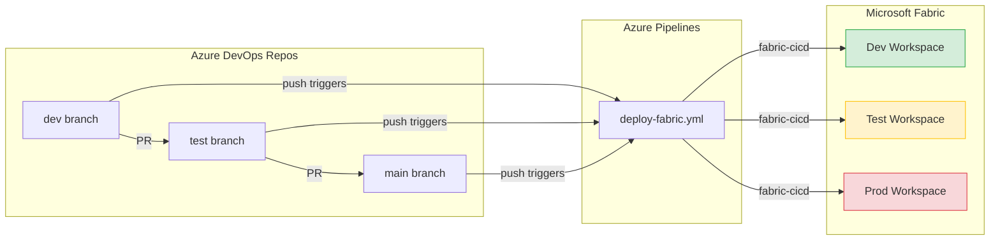

# Azure DevOps Demo — Fabric CI/CD with Git-Based Deployments

Step-by-step guide to demo the full CI/CD flow using **Azure DevOps** as the repository host and **Azure Pipelines** as the pipeline engine.

> **Time estimate:** ~30 min for first-time setup, ~10 min for repeat demos.

---

## Architecture



---

## Prerequisites

| # | Requirement | Details |
|---|---|---|
| 1 | **Azure DevOps organization** | With a project to host the repo |
| 2 | **Microsoft Fabric** | 3 workspaces: Dev, Test, Prod (Trial, Premium, or Fabric capacity) |
| 3 | **Azure Entra ID App Registration** | Service Principal with Fabric API permissions |
| 4 | **Azure subscription** | For creating the Service Connection |
| 5 | **Fabric workspace access** | The Service Principal must be added as a **Member** or **Admin** in each workspace |

---

## Step 1 — Import the Repository into Azure DevOps

1. Go to your Azure DevOps project → **Repos** → **Import a repository**
2. Clone URL: `https://github.com/samueltauil/powerbi-git-demo.git`
3. Click **Import**
4. Clone locally:
   ```bash
   git clone https://dev.azure.com/<org>/<project>/_git/powerbi-git-demo
   cd powerbi-git-demo
   ```

---

## Step 2 — Create the Branch Structure

Create `dev` and `test` branches from `main`:

```bash
git checkout -b dev
git push -u origin dev

git checkout -b test
git push -u origin test

git checkout main
```

---

## Step 3 — Create the Azure Entra ID App Registration

> Same as the GitHub demo — if you already have one, skip to Step 4.

1. Go to [Azure Portal](https://portal.azure.com) → **Microsoft Entra ID** → **App registrations** → **New registration**
2. Name: `Fabric CI/CD`
3. Supported account type: **Single tenant**
4. Click **Register**
5. Note the **Application (client) ID** and **Directory (tenant) ID**
6. Go to **Certificates & secrets** → **New client secret** → copy the **Value**
7. Go to **API permissions** → **Add a permission** → search **Power BI Service**
   - Required: `Workspace.ReadWrite.All`
8. Grant admin consent

### Add the Service Principal to Fabric Workspaces

For each workspace (Dev, Test, Prod):
1. Open the workspace in [app.fabric.microsoft.com](https://app.fabric.microsoft.com)
2. Click **Manage access** → **Add people or groups**
3. Search for `Fabric CI/CD` (your App Registration)
4. Assign **Member** role
5. Click **Add**

---

## Step 4 — Create an Azure DevOps Service Connection

1. Go to **Project Settings** → **Service connections** → **New service connection**
2. Select **Azure Resource Manager** → **Service principal (manual)**
3. Fill in:
   - **Subscription ID / Name**: your Azure subscription
   - **Service Principal ID**: the App Registration client ID
   - **Service Principal Key**: the client secret
   - **Tenant ID**: your Entra ID tenant ID
4. Service connection name: `fabric-service-connection`
5. Check **Grant access permission to all pipelines**
6. Click **Verify and save**

---

## Step 5 — Create the Variable Group

1. Go to **Pipelines** → **Library** → **+ Variable group**
2. Name: `Fabric-Deploy`
3. Add variables:

| Variable Name | Value | Keep Secret? |
|---|---|---|
| `DEV_WORKSPACE_ID` | Dev workspace GUID | No |
| `TEST_WORKSPACE_ID` | Test workspace GUID | No |
| `PROD_WORKSPACE_ID` | Prod workspace GUID | No |
| `TEST_CONNECTION_ID` | Fabric connection GUID for the TEST semantic model | Yes |
| `PROD_CONNECTION_ID` | Fabric connection GUID for the PROD semantic model | Yes |

4. Click **Save**

> **Finding your workspace ID:** Open the workspace in Fabric → the URL contains the workspace ID:
> `https://app.fabric.microsoft.com/groups/<workspace-id>/...`

> **Tip:** For sensitive values you can also link the variable group to an Azure Key Vault.

---

## Step 6 — Create the Pipeline

1. Go to **Pipelines** → **New pipeline**
2. Select **Azure Repos Git** → select `powerbi-git-demo`
3. Select **Existing Azure Pipelines YAML file**
4. Branch: `main`, Path: `/azure-pipelines/deploy-fabric.yml`
5. Click **Continue** → **Run** (or **Save**)

---

## Step 7 — Update parameter.yml

The `parameter.yml` file uses placeholder tokens (`__TEST_CONNECTION_ID__`, `__PROD_CONNECTION_ID__`) instead of hard-coded connection GUIDs. The Azure Pipeline automatically replaces these tokens at deploy time using the variable group values from Step 5.

Update the `find_value` to match your **DEV** connection ID (the ID found in your DEV workspace):

```yaml
find_replace:
    - find_value: "your-dev-connection-id"       # DEV connection ID
      replace_value:
          TEST: "__TEST_CONNECTION_ID__"          # replaced by pipeline
          PROD: "__PROD_CONNECTION_ID__"          # replaced by pipeline
      item_type: "SemanticModel"
```

> **Note:** You only need to set the `find_value` to your real DEV connection GUID. The TEST and PROD values are injected at runtime from the Fabric-Deploy variable group — never commit real connection IDs for those environments.

Commit and push to `dev`:
```bash
git checkout dev
# edit parameter.yml
git add parameter.yml
git commit -m "Configure parameter overrides for environments"
git push
```

---

## Demo Walkthrough

### Demo 1 — Deploy to Dev

1. Make a change (e.g., edit a measure in `My new report.SemanticModel/definition/tables/Sales.tmdl`)
2. Commit and push to `dev`:
   ```bash
   git checkout dev
   # make your change
   git add .
   git commit -m "Add new measure to Sales"
   git push
   ```
3. Go to **Pipelines** in Azure DevOps → see the pipeline running
4. The pipeline deploys to the **Dev** workspace using `fabric-cicd` with `environment=DEV`
5. Open the Dev workspace in Fabric → verify the change

### Demo 2 — Promote to Test

1. Go to **Repos** → **Pull requests** → **New pull request**
2. Source: `dev` → Target: `test`
3. Review and **Complete** the PR
4. The merge triggers the pipeline on `test` branch
5. Pipeline deploys to **Test** workspace with `environment=TEST`
6. Parameter overrides applied — connection IDs swapped automatically

### Demo 3 — Promote to Prod

1. Create a PR from `test` → `main`
2. Review and complete
3. Pipeline deploys to **Prod** workspace with `environment=PROD`

### Key talking point

> "Notice we never changed any connection strings or URLs in the PR. The `parameter.yml` file tells `fabric-cicd` to swap environment-specific values at deployment time. The source files always stay in their dev state."

---

## Troubleshooting

| Problem | Solution |
|---|---|
| Pipeline not triggering | Check that the pipeline YAML is present on the target branch and triggers include that branch |
| `ModuleNotFoundError: fabric_cicd` | Ensure `requirements.txt` is present with `fabric-cicd` listed |
| Service Connection auth failure | Verify the SPN credentials in the service connection and that it has Member access to Fabric workspaces |
| Variable group not found | Ensure `Fabric-Deploy` variable group exists and is authorized for the pipeline |
| `Invalid workspace_id` | Check variable group values contain only the workspace GUID |
| Parameter overrides not applied | Verify `parameter.yml` is in the repo root and environment names match (DEV/TEST/PROD) |

---

## File Reference

| File | Purpose |
|---|---|
| `azure-pipelines/deploy-fabric.yml` | Azure Pipelines YAML — triggers on push to dev/test/main |
| `.deploy/fabric_workspace.py` | Python deployment script using fabric-cicd |
| `parameter.yml` | Environment-specific value overrides |
| `requirements.txt` | Python dependencies |
