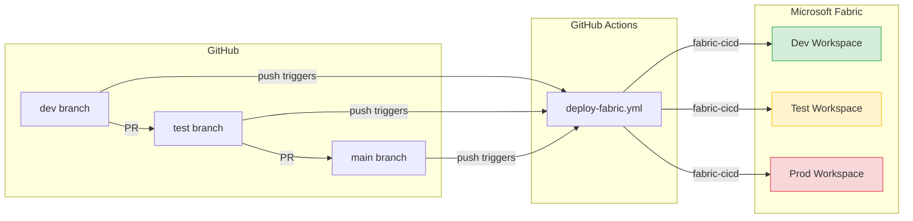

# GitHub Demo — Fabric CI/CD with Git-Based Deployments

Step-by-step guide to demo the full CI/CD flow using **GitHub** as the repository host and **GitHub Actions** as the pipeline engine.

> **Time estimate:** ~30 min for first-time setup, ~10 min for repeat demos.

---

## Architecture



---

## Prerequisites

| # | Requirement | Details |
|---|---|---|
| 1 | **GitHub account** | With a fork of `samueltauil/powerbi-git-demo` |
| 2 | **Microsoft Fabric** | 3 workspaces: Dev, Test, Prod (Trial, Premium, or Fabric capacity) |
| 3 | **Azure Entra ID App Registration** | Service Principal with Fabric API permissions |
| 4 | **Fabric workspace access** | The Service Principal must be added as a **Member** or **Admin** in each workspace |

---

## Step 1 — Fork the Repository

1. Go to [github.com/samueltauil/powerbi-git-demo](https://github.com/samueltauil/powerbi-git-demo)
2. Click **Fork** → select your account → **Create fork**
3. Clone your fork locally:
   ```bash
   git clone https://github.com/<your-username>/powerbi-git-demo.git
   cd powerbi-git-demo
   ```

---

## Step 2 — Create the Branch Structure

Create `dev` and `test` branches from `main`:

```bash
git checkout -b dev
git push -u origin dev

git checkout -b test
git push -u origin test

git checkout main
```

You now have three long-lived branches: `dev`, `test`, `main`.

---

## Step 3 — Create the Azure Entra ID App Registration

1. Go to [Azure Portal](https://portal.azure.com) → **Microsoft Entra ID** → **App registrations** → **New registration**
2. Name: `Fabric CI/CD`
3. Supported account type: **Single tenant**
4. Click **Register**
5. Note the **Application (client) ID** and **Directory (tenant) ID**
6. Go to **Certificates & secrets** → **New client secret** → copy the **Value**
7. Go to **API permissions** → **Add a permission** → **APIs my organization uses** → search **Power BI Service** → select **Delegated permissions** or **Application permissions** as needed
   - Required: `Workspace.ReadWrite.All`
8. Grant admin consent

### Add the Service Principal to Fabric Workspaces

For each workspace (Dev, Test, Prod):
1. Open the workspace in [app.fabric.microsoft.com](https://app.fabric.microsoft.com)
2. Click **Manage access** → **Add people or groups**
3. Search for your App Registration name (`Fabric CI/CD`)
4. Assign **Member** role
5. Click **Add**

---

## Step 4 — Configure GitHub Environments and Secrets

### Create three GitHub Environments

1. Go to your fork → **Settings** → **Environments**
2. Create three environments: `DEV`, `TEST`, `PROD`

### Add secrets to each environment

For **each** environment (DEV, TEST, PROD), add these secrets:

| Secret Name | Value |
|---|---|
| `AZURE_CLIENT_ID` | App Registration client ID |
| `AZURE_CLIENT_SECRET` | App Registration client secret |
| `AZURE_TENANT_ID` | Entra ID tenant ID |
| `FABRIC_WORKSPACE_ID` | The target Fabric workspace GUID for this environment |
| `TEST_CONNECTION_ID` | Fabric connection GUID for the TEST semantic model |
| `PROD_CONNECTION_ID` | Fabric connection GUID for the PROD semantic model |

> **Finding your workspace ID:** Open the workspace in Fabric → the URL contains the workspace ID:
> `https://app.fabric.microsoft.com/groups/<workspace-id>/...`

---

## Step 5 — Update parameter.yml

The `parameter.yml` file uses placeholder tokens (`__TEST_CONNECTION_ID__`, `__PROD_CONNECTION_ID__`) instead of hard-coded connection GUIDs. The GitHub Actions workflow automatically replaces these tokens at deploy time using the secrets you configured in Step 4.

Update the `find_value` to match your **DEV** connection ID (the ID found in your DEV workspace):

```yaml
find_replace:
    - find_value: "your-dev-connection-id"       # DEV connection ID
      replace_value:
          TEST: "__TEST_CONNECTION_ID__"          # replaced by pipeline
          PROD: "__PROD_CONNECTION_ID__"          # replaced by pipeline
      item_type: "SemanticModel"
```

> **Note:** You only need to set the `find_value` to your real DEV connection GUID. The TEST and PROD values are injected at runtime from GitHub Secrets — never commit real connection IDs for those environments.

Commit and push to `dev`:
```bash
git checkout dev
# edit parameter.yml
git add parameter.yml
git commit -m "Configure parameter overrides for environments"
git push
```

---

## Demo Walkthrough

### Demo 1 — Deploy to Dev

1. Make a change to the report or semantic model (e.g., edit a measure in `My new report.SemanticModel/definition/tables/Sales.tmdl`)
2. Commit and push to `dev`:
   ```bash
   git checkout dev
   # make your change
   git add .
   git commit -m "Add new measure to Sales"
   git push
   ```
3. Go to **Actions** tab in GitHub → see the workflow running
4. The workflow deploys to the **Dev** workspace using `fabric-cicd` with `environment=DEV`
5. Open the Dev workspace in Fabric → verify the change is there

### Demo 2 — Promote to Test

1. Create a PR from `dev` → `test` in GitHub
2. Review and merge the PR
3. The merge triggers the workflow on the `test` branch
4. Workflow deploys to the **Test** workspace with `environment=TEST`
5. Parameter overrides from `parameter.yml` are applied automatically (e.g., connection IDs swapped)

### Demo 3 — Promote to Prod

1. Create a PR from `test` → `main`
2. Review and merge
3. Workflow deploys to **Prod** workspace with `environment=PROD`

### Key talking point

> "Notice we never changed any connection strings or URLs in the PR. The `parameter.yml` file tells `fabric-cicd` to swap environment-specific values at deployment time. The source files always stay in their dev state."

---

## Troubleshooting

| Problem | Solution |
|---|---|
| Workflow not triggering | Check that branch protection rules allow pushes, and that the workflow file exists on the target branch |
| `ModuleNotFoundError: fabric_cicd` | Ensure `requirements.txt` is present with `fabric-cicd` listed |
| Authentication failure | Verify the SPN has Member access to the target workspace and that secrets are set correctly in the right GitHub Environment |
| `Invalid workspace_id` | Check that `FABRIC_WORKSPACE_ID` secret contains only the GUID (no URL prefix) |
| Parameter overrides not applied | Verify `parameter.yml` is in the repo root and environment names match (DEV/TEST/PROD) |

---

## File Reference

| File | Purpose |
|---|---|
| `.github/workflows/deploy-fabric.yml` | GitHub Actions workflow — triggers on push to dev/test/main |
| `.deploy/fabric_workspace.py` | Python deployment script using fabric-cicd |
| `parameter.yml` | Environment-specific value overrides |
| `requirements.txt` | Python dependencies |
